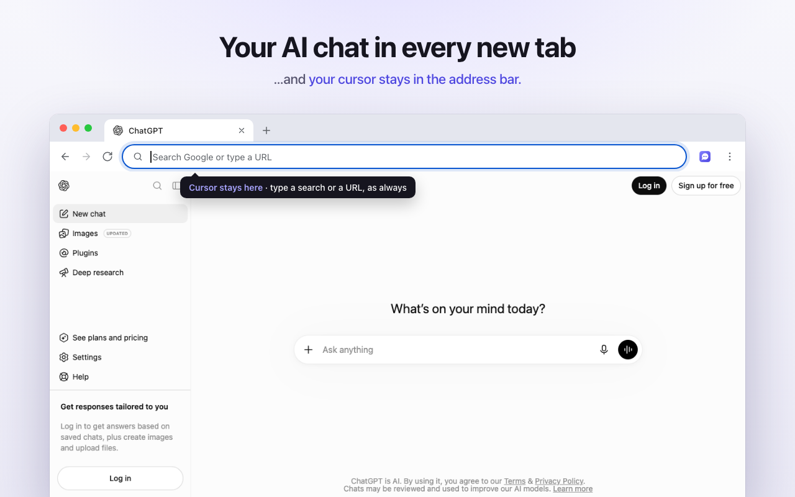
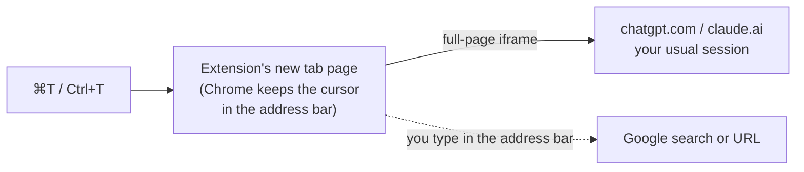

<p align="center">
  
</p>

<h1 align="center">Straight to Chat</h1>

<p align="center">
  <b>ChatGPT or Claude in every new tab, and your cursor stays in the address bar.</b><br>
  A tiny, open-source Chrome extension. No tracking, no API key, no wrapper: your real chat, one keystroke away.
</p>

<p align="center">
  <a href="LICENSE"></a>
  
  
</p>

<p align="center">
  
</p>

## Why

Opening a new tab is the fastest way to ask an AI something. But the usual ways of putting ChatGPT or Claude on your new tab page cost you something:

- **Redirect extensions** send the tab to chatgpt.com, and the page grabs your cursor: you can't just type a Google search or a URL anymore.
- **"AI new tab" dashboards** wrap the model in their own interface, often with an API key, ads or tracking, and without your history, projects or settings.

**Straight to Chat** loads the real chatgpt.com or claude.ai, signed in with your usual account, right inside the new tab, while **the cursor stays in the address bar**. Press <kbd>⌘</kbd><kbd>T</kbd> / <kbd>Ctrl</kbd><kbd>T</kbd>, then either type a search or URL as always, or click into the chat.

## Features

- ⌨️ **The address bar keeps the cursor.** Search or type a URL instantly, exactly like Chrome's default new tab.
- ⚡ **Fast.** No framework, a few kilobytes, no redirect hop: the site starts loading as soon as the tab opens, over the background color the site itself uses (no white flash).
- 💬 **Your real chat.** Your account, history, projects, voice mode, file uploads: it's the actual site, not an API wrapper.
- 🔀 **ChatGPT, Claude or any URL**, switched in one click from the toolbar icon. Custom URLs work for specific pages too: a ChatGPT or Claude project, a custom GPT, a self-hosted Open WebUI on `http://localhost:3000`…
- 🏷️ **The tab shows your conversation's title**, not just "ChatGPT".
- 🔒 **Private.** No analytics, no remote code, no server. Access limited to chatgpt.com and claude.ai, plus the custom site you pick, if any ([details](#permissions)).
- 🌍 English and French.

## Install

**Chrome Web Store:** coming soon.

**Manually (2 minutes, Chrome 145 or later):**

1. Download `straight-to-chat-<version>.zip` from the [latest release](https://github.com/BlaisedEstais/straight-to-chat/releases/latest) and unzip it (or `git clone` this repo).
2. Open `chrome://extensions`, turn on **Developer mode** (top right), click **Load unpacked** and select the unzipped folder (the `extension` folder if you cloned the repo).
3. The welcome page opens: pick ChatGPT or Claude. Done. Press <kbd>⌘</kbd><kbd>T</kbd> / <kbd>Ctrl</kbd><kbd>T</kbd>.

Two one-time things worth knowing:

- **Sign in once in a regular tab.** Sign-in pages refuse to load inside another page, so log in to ChatGPT or Claude in a normal tab; the new tab then uses the same session.
- Chrome may ask whether to keep the new tab page an extension provides: keep it. Since Chrome 138, extension new tabs also get a small footer; right-click it to hide it.

### Ask your AI agent to install it

Paste this into Claude Code, Codex or any coding agent:

```text
Install the Chrome extension from https://github.com/BlaisedEstais/straight-to-chat:
clone it, read AGENTS.md, then walk me through loading its extension/ folder
in chrome://extensions (Developer mode → Load unpacked).
```

## Usage

- **Switch between ChatGPT, Claude and a custom URL:** click the extension's icon in the toolbar (pin it from the puzzle-piece menu), or open its options.
- **Keep the cursor in the address bar** is on by default. Turn it off to open the site as a regular page instead: the page takes the cursor, but everything works, including Claude artifact previews and ChatGPT canvas previews (see [limitations](#known-limitations)).
- **Open the current chat in a regular tab:** <kbd>⌘</kbd>/<kbd>Ctrl</kbd>-click it in the site's sidebar.

## How it works



1. The extension overrides the new tab page (`chrome_url_overrides`). Chrome gives the address bar focus on new tabs, and because the tab never navigates away, nothing takes that focus back.
2. The page reads your choice synchronously from a local cache and immediately creates a full-page `<iframe>` to the site. No network call, no `await` before the site starts loading.
3. ChatGPT and Claude normally forbid being shown inside another page (`X-Frame-Options`, CSP `frame-ancestors`). A [`declarativeNetRequest`](https://developer.chrome.com/docs/extensions/reference/api/declarativeNetRequest) rule removes those two response headers for the site's frames **only in a tab whose top-level page is this extension's new tab** (`topDomains` = the extension's ID; no web page can be that). In regular tabs, and when any other website tries to frame these sites, their headers stay fully intact; the test suite checks both.
4. Chrome treats a site framed by an extension page that has access to it as first-party, so you're signed in with your usual cookies.
5. A small content script inside the framed site sends its page title, icon and background color up to the tab, so tabs show your conversation names and the next new tab paints the right color before the site loads.

Everything is in [`extension/`](extension): a few hundred lines of JavaScript, plus some HTML and CSS. [AGENTS.md](AGENTS.md) maps the code for humans and coding agents.

## Permissions

| Permission | Why | What Chrome shows |
|---|---|---|
| `chatgpt.com`, `claude.ai` | Show these sites inside the new tab, and read their page title, icon and background color for the tab | "Read and change your data on chatgpt.com and claude.ai" |
| `declarativeNetRequestWithHostAccess` | The scoped header rule described above | No extra warning |
| `storage` | Save your choice (synced across your devices by Chrome sync) | No warning |
| Optional: one custom site | Requested only when you set a custom URL, for that site only, and given back when you switch away from it | Asked at that moment |

Inside the new tab, ChatGPT and Claude may use the microphone (voice mode) and the clipboard (copy buttons), with Chrome's usual prompts. A custom site gets neither, so it can't inherit access you gave them. No data leaves your browser: see [PRIVACY.md](PRIVACY.md).

## Known limitations

- **Sign-in happens in a regular tab** (see above). That's the sites' choice, and a sound one.
- **Claude artifact previews and ChatGPT canvas or app previews** run in the vendors' own sandboxed frames, which only allow chatgpt.com, claude.ai and the vendors' own extensions as parents. They stay blank inside the new tab. Open the chat in a regular tab (<kbd>⌘</kbd>/<kbd>Ctrl</kbd>-click it in the sidebar), or turn off "Keep the cursor in the address bar". Stripping those sandboxes' security policies would be unsafe, so the extension deliberately doesn't.
- **Some custom sites refuse to work inside a frame.** Turn off "Keep the cursor in the address bar" for those.
- **Incognito windows** keep Chrome's own new tab page (a Chrome rule for extensions).
- Built and tested for **Google Chrome 145+**. Other Chromium browsers that support new tab overrides (Edge, Brave…) should work but aren't tested.

## FAQ

**Is removing security headers safe?**
The two headers are removed only for frames of the site you chose inside the extension's own new tab: the rule's conditions are `resourceTypes: ['sub_frame']`, `requestDomains: [the site]` and `topDomains: [the extension's ID]`, and no web page can ever be the extension's page. Any other page trying to embed ChatGPT or Claude (the clickjacking scenario those headers prevent) is still blocked, and regular tabs are untouched. `npm test` verifies both.

**Does it read my conversations?**
No. The content script reads only the page title, icon and background color, and only while the site is inside the extension's new tab. There's no server to send anything to anyway: see [PRIVACY.md](PRIVACY.md).

**Why not just redirect new tabs to chatgpt.com?**
Then the tab becomes chatgpt.com and the page takes keyboard focus: typing a search in the address bar needs an extra click or <kbd>⌘</kbd><kbd>L</kbd> every time. Staying on the extension's page is what keeps the cursor where you expect it.

**A new tab says the site "refused to connect".**
Make sure you're signed in (in a regular tab), and that the extension still has access to the site: puzzle-piece menu → Straight to Chat → allow on this site. Without access, the extension falls back to opening the site as a regular page.

## Project status

A small tool shared as-is: it works, and it isn't actively maintained. Issues and pull requests are turned off. If you'd like it to do something else, **fork it**: it's MIT-licensed, and [AGENTS.md](AGENTS.md) lets a coding agent find its way around in seconds.

If it saves you a few seconds a day, a ⭐ helps other people find it.

## License

[MIT](LICENSE).

Straight to Chat is an independent project, not affiliated with, endorsed or sponsored by OpenAI or Anthropic. ChatGPT is a trademark of OpenAI. Claude is a trademark of Anthropic.
